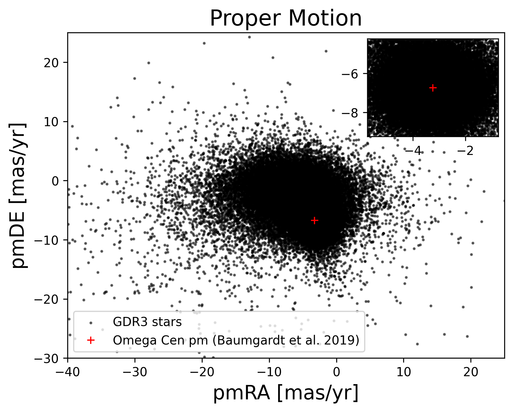
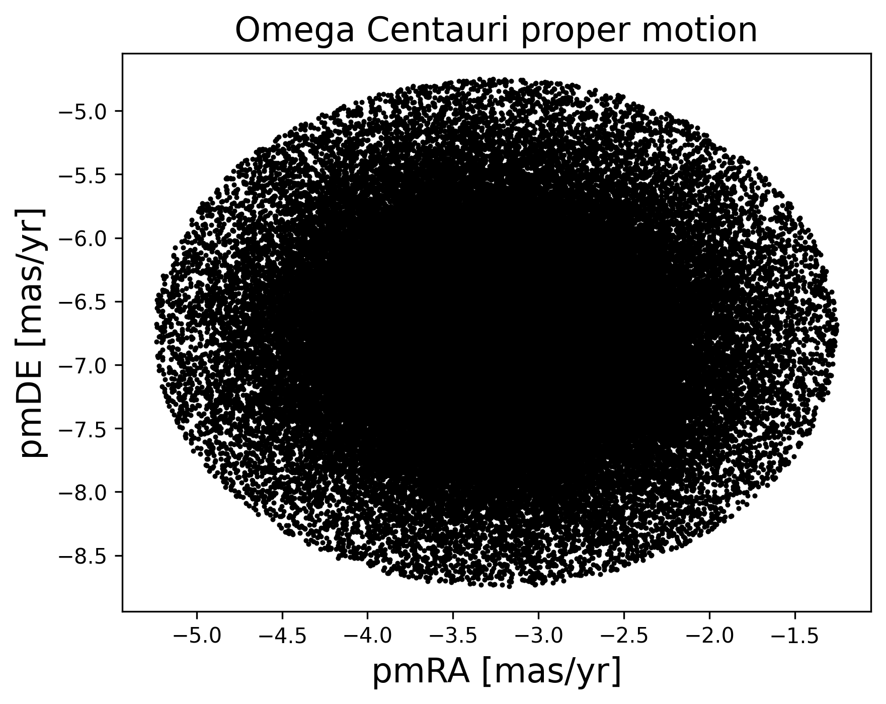
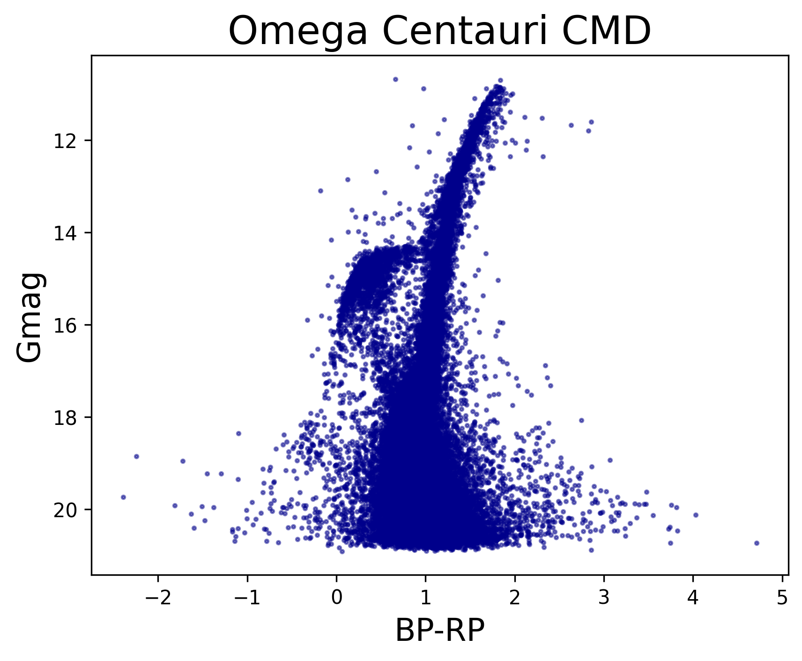

# Arqueología Galáctica y el Misterio de Omega Centauri

## Cúmulo globular
Omega Centauri es un cúmulo globular que se considera podría ser el remanente del núcleo de una galaxia satelite que fue absorbida por la vía
láctea. Tiene coordenadas (ICRS) $\text{RA: } 13° 26' 47.28''; \text{ DE: } -47° 28' 46.1''$, que en grados son $\text{RA: } 201.697° \text{ DE: } -47.479°$.
Haciendo una selección de las estrellas dentro de un diámetro angular de $0.5°$ se pretende encontrar la membresía del cúmulo.\
\
Al analizar los movimientos propios de las estrellas de la región a partir de los datos de Gaia DR3, se encuentra una dispersión de estrellas donde hay una clara y densa
concentración de cuerpos en torno al punto $(\text{pmRA}, \text{pmDE}) = (-3.24, -6.73) \text{ mas/yr}$, el movimiento propio reportado del cúmulo por [Baumgardt et al. (2019)](https://doi.org/10.1093/mnras/sty2997). Esto confirma que esta distribución corresponde a Omega Centauri y es donde debemos centrar nuestros esfuerzos. Posteriormente, [Vasiliev & Baumgart (2021)](https://doi.org/10.1093/mnras/stab1475) reportaron un movimiento propio muy similar utilizando datos del EGDR3, $\text{pmRA} = -3.250 \text{ mas/yr}$ y $\text{pmDE} = -6.746 \text{ mas/yr}$.

<b> Figura 1 </b>

## Procedimiento
Una vez identificado el racimo en el diagrama de movimientos propios y el movimiento propio global, se procedió a realizar una nueva busqueda filtrada unicamente con las estrellas en esta región
que cumplieran la condición de no estar a una distancia mayor de $2.5 \text{ mas/yr}$ del movimiento propio global, este valor se selecciona de manera completamente arbitraria según la visualización de la **Figura 1**, resultando en la selección de estrellas de la **Figura 2**. Es claro que esta región no selecciona todas las estrellas pertenecientes al cúmulo, sin embargo, representa una primera aproximación. 

<b> Figura 2 </b>

Los cúmulos son poblaciones estelares que tienen la misma edad en promedio, si escogimos bien las estrellas del cúmulo, estas deben seguir una distribución clásica en el diagrama. En los diagramas color magnitud (CMD) de los cúmulos globulares es común encontrar una dispersión muy grande en la parte inferior de la gráfica representando a las estrella menos masivas, una rama de las gigantes rojas muy estrecha y la característica región de la rama horizontal (ver [Stellar Populations - Lecture I](https://pages.astro.umd.edu/~rmushotz/ASTRO620/stellarpops11_lec1.pdf), pag. 15, para un ejemplo). A continuación, el CMD de Omega Centauri, donde vemos la morfología anterior.

<b> Figura 3 </b>

Finalmente,es apropiado comparar nuestros resultados con aquellos en la literatura. Para esto, vamos a utilizar el catálogo de [Vasiliev & Baumgart (2021)](https://doi.org/10.1093/mnras/stab1475)
seleccionando las estrellas que tengan una probabilidad de membresía mayor al 95%. Graficando los movimientos propios obtenemos

<b> Figura 4 </b>

En este repositorio:
* 1_descarga_omega.sh:

13 26 47.28 -47 28 46.1
